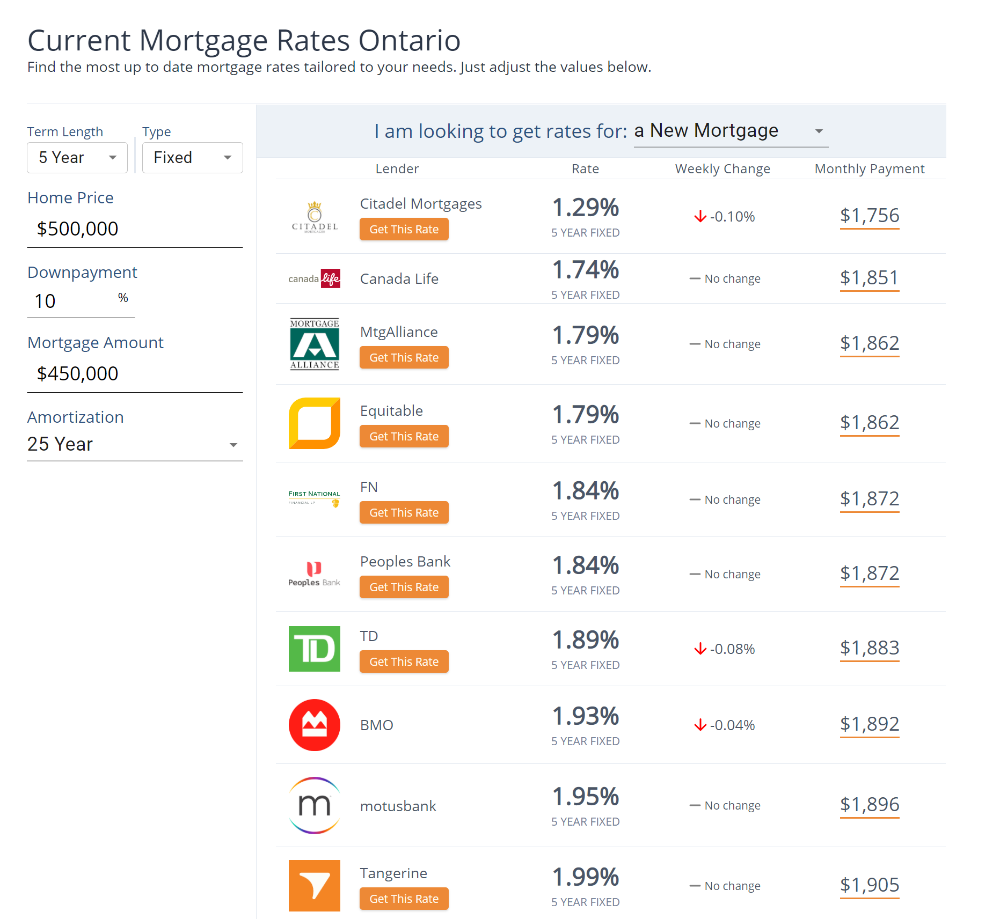

# WOWA Challenge

The goal of this project is to introduce you to our tech stack. Our frontend uses React with Redux and TailwindCSS. Our backend uses Django with Django Rest Framework (DRF) and PostgreSQL.

## Task: Create a mortgage rates table and simple calculator

You will need to create and design a full-stack application that shows Canada mortgage rates and allows you to calculate your mortgage payments, essentially recreating the bottom of https://wowa.ca/mortgage-rates-ontario



## Objectives

* Frontend must be coded using Typescript

* You should have a table of mortgage rates with the following columns: Lender, Rate, Monthly Payment. You will not add "Weekly Change"

* You should have a mortgage calculator with options to change term length and type based on the data available. The results shown in the rates table should reflect the current selected term length and type. The results in the column of Monthly Payment should reflect the parameters entered.

* You do not have to implement the "I am looking to get rates for..." part of the table

* You do not have to implement "Get This Rate"

* Your design should be responsive, but the implementation is up to you. You can show different components for different breakpoints, but the overall design should stay consistent across screen widths.

* Your data should be stored in a PostgreSQL database

* Your rates data should be retrieved using a GET request to your Django application. You must use a django-rest-framework request handler, but you can use a @api_view, a View, or a ViewSet. 

## Code

I have provided a base Next.JS setup with the following features:

* Prettier + ESLint code formatting

* Integrated Typescript

* Integrated TailwindCSS

You should extend it, putting your pages in `/pages` and other components in `/src`.

Your data model for mortgage rates should be as follows (in TypeScript notation):

```
MortgageRate:
  source: string
  year: number
  created: Date (Not DateTime)
  updated: Date (Not DateTime | Optional)
  down_payment_level: number (will not be used)
  first_mortgage: boolean (will not be used)
  long_amortization: boolean (will not be used)
  rate_type: string
  rate: number
  posted: boolean (will not be used)
  refinance_rate: number (will not be used)
```

It is up to you to implement the Django data model appropriately.

## Data

I have provided some data at [data/rates.json](data/rates.json). It follows the above format.

As for the logos, feel free to take them from our website (right-click and `Save image`). 


## Helpful Links

React: https://reactjs.org/

Next.JS: https://nextjs.org/

TailwindCSS: https://tailwindcss.com/

Material-UI: https://material-ui.com/

TypeScript: https://www.typescriptlang.org/

Django: https://www.djangoproject.com/

django-rest-framework: https://www.django-rest-framework.org/

PostgreSQL: https://www.postgresql.org/


